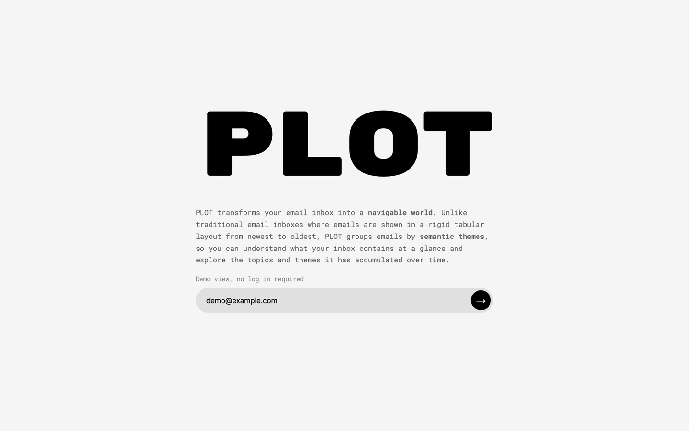
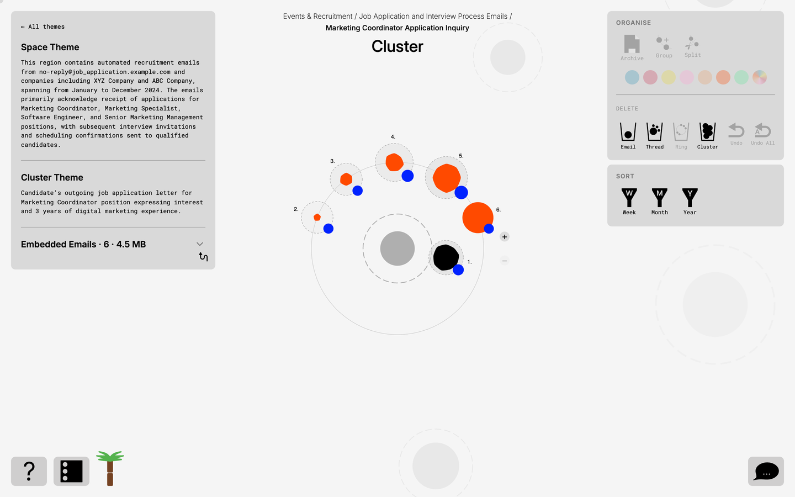
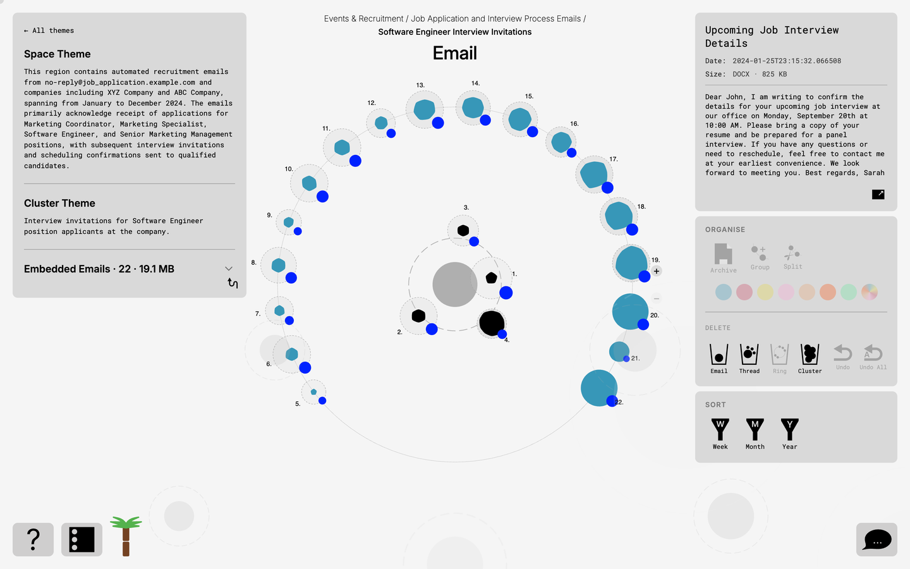
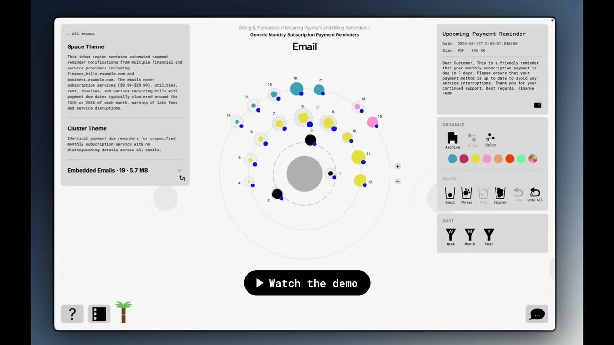
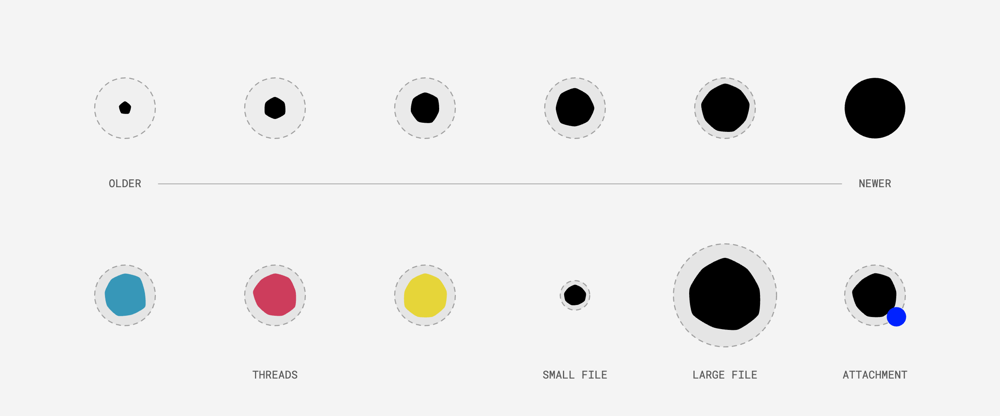
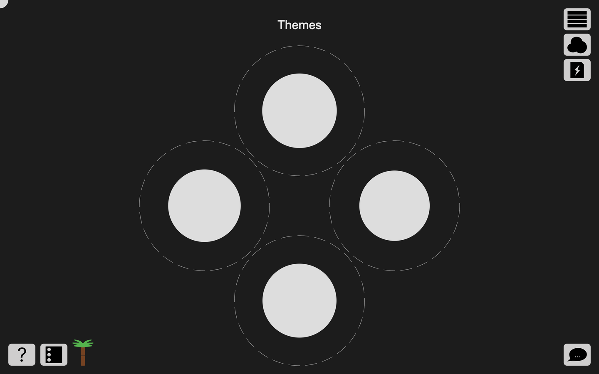
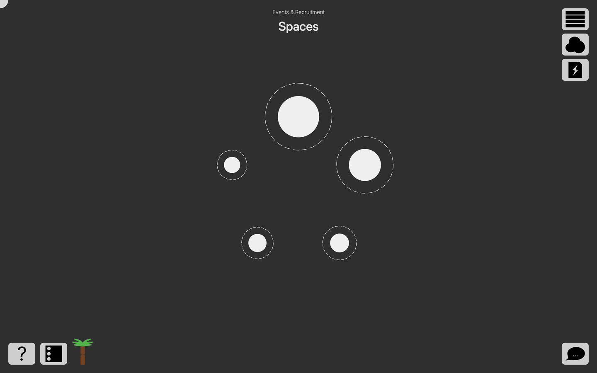
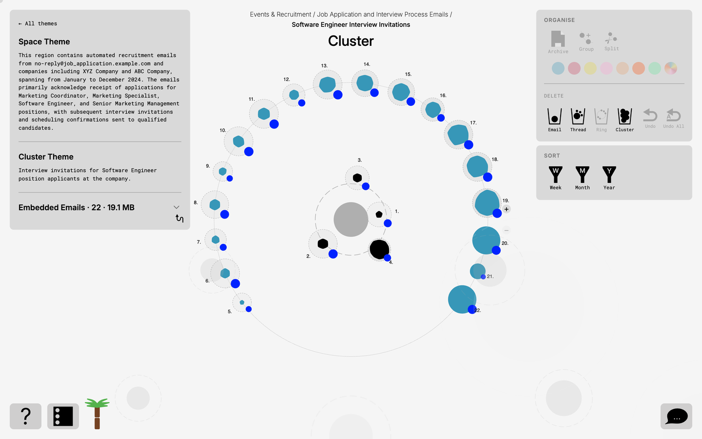
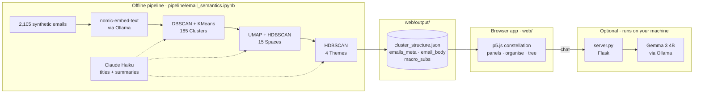

<div align="center">

<picture>
  <source media="(prefers-color-scheme: dark)" srcset="docs/images/logo-dark.png">
  
</picture>

<br>
<br>

**The email inbox as a navigable world.**
<br>
A proof of concept that groups email into clusters of increasing specificity, from broad themes down to individual topics.

<br>

[](https://plot-demo.netlify.app/)


[](#license)

[**Try it live**](https://plot-demo.netlify.app/) · [Watch the demo](https://www.youtube.com/watch?v=20Sa4PoC53U) · [How it works](#how-it-works) · [Run it locally](#run-it-locally)

<br>


&nbsp;

&nbsp;


</div>

> [!IMPORTANT]
> **Free for non-commercial use. Commercial use requires a licence.**
> You're welcome to use, study and adapt PLOT for personal, educational and non-profit projects.
> If you'd like to use it commercially, build a product on it, or work together on a similar idea, [get in touch](https://kubajarzebski.xyz/). See [License](#license).

> [!NOTE]
> **PLOT is a proof of concept, not a finished product.** The demo runs on 2,105 synthetic emails from a public dataset, not a real inbox. Sign-in is simulated, and everything you do in the app resets when you reload the page.

<br>

## See it in action: Video Walkthrough

<div align="center">
  <a href="https://www.youtube.com/watch?v=20Sa4PoC53U">
    
  </a>
  <br>
  <sub>A walkthrough from the Themes view down to a single email. Opens on YouTube.</sub>
</div>

## The idea

PLOT transforms the email inbox into a **navigable world**. Unlike traditional inboxes, where emails are arranged in rigid chronological lists, PLOT groups them into clusters of increasing specificity. The deeper users explore, the more detailed the information becomes, moving from broad themes to individual topics.

Arranged in radial layouts rather than rows, it makes large volumes of email easier to navigate, organise, and manage. By revealing patterns built up over years of use, PLOT helps people better understand, curate, and take control of their digital archives.

**How it plays out:** you open PLOT and see your whole inbox as a handful of Themes. Step into one and it splits into Spaces, then into Clusters of closely related emails, each with a plain-English title and summary. Inside a Cluster, every email is a dot on a ring, grouped into colour-coded conversation threads. Click one to read it, or reshape the Cluster by hand: group, split, archive or delete. Delete enough and the tree in the corner starts to grow.

<div align="center">
  
  <br>
  <sub>Every email is drawn from the same few rules. It fills out as it gets newer, takes its thread's colour, grows with its file size, and gets a blue dot if it has an attachment.</sub>
</div>

## Exploring an inbox, step by step

<table>
  <tr>
    <td align="center" width="25%"></td>
    <td align="center" width="25%"></td>
    <td align="center" width="25%"></td>
    <td align="center" width="25%"></td>
  </tr>
  <tr>
    <td align="center"><b>1. Themes</b><br><sub>The whole inbox as four broad topics, sized by data volume.</sub></td>
    <td align="center"><b>2. Spaces</b><br><sub>Each Theme opens into Spaces of related subjects.</sub></td>
    <td align="center"><b>3. Clusters</b><br><sub>Emails on rings, with threads in colour and a summary alongside.</sub></td>
    <td align="center"><b>4. Email</b><br><sub>Click a dot to read it. Arrow keys step between emails.</sub></td>
  </tr>
</table>

## Features

- **Three levels of meaning.** 2,105 emails are organised into 4 Themes, 15 Spaces and 185 Clusters, each titled and summarised by an LLM.
- **Threads in colour.** Emails in a Cluster that share a subject line form a thread, drawn in one of 7 colours on concentric rings.
- **An inbox you can reshape.** Shift-click to select several emails, then group them into a new thread, split a thread, delete, or sort the rings by week, month or year.
- **Archive and read mode.** Copy emails into a personal Archive Theme, or open one in a focused read mode to highlight passages and add notes.
- **A tree that grows as you delete.** PLOT estimates the carbon and water cost of storing your email. Every 5 emails you delete grow the palm tree in the corner by one of its 9 stages.
- **Ask your inbox.** A chat panel answers questions like "emails from finance in 2024" using a Gemma model running locally in Ollama. It works when you run `server.py` on your own machine.
- **Keyboard-first navigation.** Enter goes a level deeper, Esc steps back, and the arrow keys move between Themes, Spaces, Clusters and emails.

## Try it

Open [**plot-demo.netlify.app**](https://plot-demo.netlify.app/) in a desktop browser. It opens on a demo account with no log in required: click the arrow, skip or follow the guided tour, and press Enter to step into a Theme.

<sub>PLOT is designed for desktop and needs a mouse and keyboard. The chat assistant only answers when `server.py` and Ollama are running on your own machine.</sub>

## How it works

The heavy work happens **offline**. A Jupyter notebook embeds every email, clusters the embeddings at three levels and asks an LLM to name each group. It writes the result as plain JSON. The **app** is a static p5.js page that reads those files, so it can be hosted anywhere for free and makes no AI calls. An optional local Flask server adds the chat assistant.



1. **Embed.** Each email's subject and body is turned into a 768-dimensional vector by nomic-embed-text, running locally in Ollama.
2. **Cluster.** DBSCAN groups nearby vectors into Clusters, and KMeans splits any that grow too large. Cluster centroids are reduced with UMAP and grouped into Spaces with HDBSCAN, and Space centroids are grouped again into Themes.
3. **Label.** Claude Haiku reads up to five sample emails from each Cluster and writes its title and summary. Spaces are then named from their Clusters' titles and summaries, and Themes from their Spaces', so only already-abstracted text reaches the higher levels.
4. **Explore.** The notebook exports one JSON file per Cluster and per email. The browser loads the structure up front, fetches a Space's emails when you open it, and loads an email's full text when you click it.

## Tech stack

| Layer | Tools |
|---|---|
| Frontend | p5.js, vanilla JavaScript, HTML/CSS, Rubik Mono One, Rubik and Roboto Mono typefaces |
| Data pipeline | Python, Jupyter, scikit-learn (DBSCAN, KMeans), UMAP, HDBSCAN, pandas |
| AI models | nomic-embed-text and Gemma 3 4B via Ollama (local), Claude Haiku 4.5 via the Anthropic API |
| Chat server | Flask (optional, local only) |
| Hosting | Netlify (static) |

## Project structure

```
├── web/                        The app, served as a static site
│   ├── index.html              Page markup, onboarding and panels
│   ├── panel.css               All styles
│   ├── bundle.js               The modules in js/, concatenated
│   ├── js/                     Source modules: layout, nodes, panels, chat, tree…
│   └── output/                 Pipeline output the app loads
├── pipeline/
│   ├── email_semantics.ipynb   Embed, cluster, label and export
│   └── requirements.txt        Pipeline dependencies
├── scripts/
│   ├── build-bundle.sh         Rebuilds web/bundle.js from web/js/
│   └── export-static.py        Prepares pipeline output for static hosting
├── server.py                   Optional local server with the chat assistant
├── requirements.txt            Server dependencies
└── docs/images/                Logo, screenshots and README visuals
```

## Run it locally

**Requirements:** Python 3 (tested with 3.14). For the chat assistant, [Ollama](https://ollama.com) with the `gemma3:4b` and `nomic-embed-text` models.

The app is static, so any web server works as long as `web/` is the site root:

```bash
git clone https://github.com/qubula/PLOT.git
cd PLOT/web
python3 -m http.server 8000
```

Open <http://localhost:8000>.

To use the chat assistant as well, run the Flask server instead. It serves the same app and adds the chat endpoint:

```bash
cd PLOT
python3 -m venv venv
source venv/bin/activate
pip install -r requirements.txt

ollama pull gemma3:4b
ollama pull nomic-embed-text
python server.py
```

Open <http://localhost:5001>.

### Rebuilding the data

The notebook regenerates everything in `web/output/`. Download `email_dataset.json` from the [dataset page](https://huggingface.co/datasets/imnim/multiclass-email-classification) and save it as `pipeline/data/MultiClasssEmail Dataset.json`. Then:

```bash
cd PLOT
pip install -r pipeline/requirements.txt
cp .env.example .env
jupyter notebook pipeline/email_semantics.ipynb
```

Add your Anthropic key to `.env` and run all cells. Then bake the static files with `python scripts/export-static.py`. If you edit anything in `web/js/`, rebuild the bundle with `sh scripts/build-bundle.sh`.

### Environment variables

| Variable | Used by | Notes |
|---|---|---|
| `ANTHROPIC_API_KEY` | Pipeline notebook | Only needed to relabel clusters with Claude Haiku. |
| `PORT` | `server.py` | Defaults to 5001. The app's chat panel expects 5001. |
| `HOST` | `server.py` | Defaults to `127.0.0.1`, so the server is only reachable from your machine. |

### Deploying

The live demo is the `web/` folder deployed to [Netlify](https://www.netlify.com) as a static site. Drag the folder onto [Netlify Drop](https://app.netlify.com/drop) while signed in, or connect the repository and set the publish directory to `web`. The app loads its data from `/output/`, so `web/` must be the site root.

## License

PLOT is **source-available** under the [PolyForm Noncommercial License 1.0.0](LICENSE).

| Use | Cost |
|---|---|
| Personal projects, learning, teaching, research, portfolios, non-profit organisations | ✅ **Free** |
| Anything that makes money: paid apps, client work, ad-supported products, use inside a business | 💼 **Commercial licence required** ([contact me](https://kubajarzebski.xyz/)) |

**Commercial licensing and collaboration.** If you want to develop PLOT into a product, build something similar, or bring me in to help, I'd be glad to talk. Contact me through my [portfolio](https://kubajarzebski.xyz/) or on [LinkedIn](https://www.linkedin.com/in/jakub-jarzebski).

Third-party data, libraries, fonts and models keep their own licences; see [LICENSE](LICENSE) for details.

## Credits

- Email data: [multiclass-email-classification](https://huggingface.co/datasets/imnim/multiclass-email-classification) by imnim, 2,105 synthetic emails (MIT). Sender addresses, dates, file sizes and attachments are simulated by the pipeline.
- Rendering: [p5.js](https://p5js.org) (LGPL 2.1)
- Typefaces: [Rubik and Rubik Mono One](https://fonts.google.com/specimen/Rubik) (SIL Open Font License), [Roboto Mono](https://fonts.google.com/specimen/Roboto+Mono) (Apache 2.0)
- Models: [nomic-embed-text](https://huggingface.co/nomic-ai/nomic-embed-text-v1) by Nomic AI (Apache 2.0), [Gemma](https://ai.google.dev/gemma/terms) by Google (Gemma Terms of Use), [Claude Haiku](https://www.anthropic.com/claude) by Anthropic (via API)
- Carbon estimates: based on figures from Mike Berners-Lee's *How Bad Are Bananas?*

<br>

<div align="center">
Designed and built by <b>Jakub Jarzebski</b>
<br>
<a href="https://kubajarzebski.xyz/">Portfolio</a> · <a href="https://www.linkedin.com/in/jakub-jarzebski">LinkedIn</a> · <a href="https://github.com/qubula">GitHub</a>
</div>
